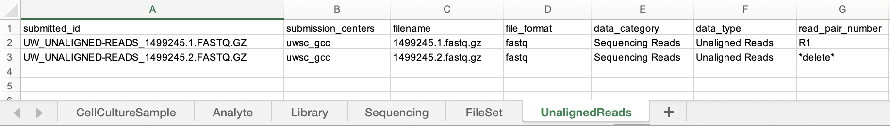
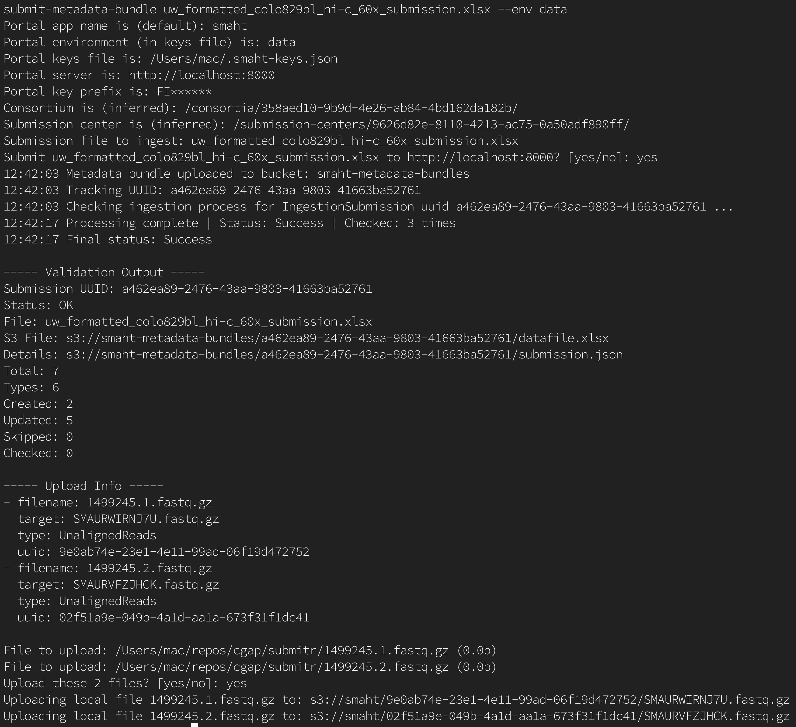
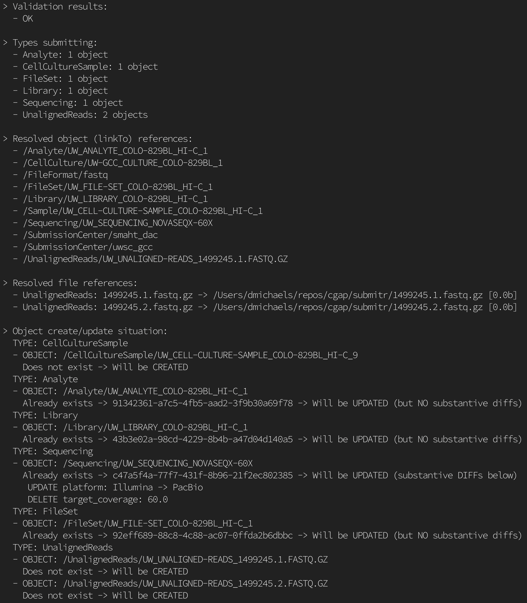

===================
Submitting Metadata
===================

Once you have finished installing the ``smaht-submitr`` package (per the `Installation <installation.html>`_ section),
you should have access to the :boldcode:`submit-metadata-bundle` command.
What follows are detailed instructions for how to format your metatdata submission files,
and how to actually submit (and validate) them to SMaHT Portal using this command.

Formatting Files for Submission
===============================

Most commonly, the file format recommended for metadata submission to SMaHT Portal,
is an Excel spreadsheet file (e.g. ``your_metadata_file.xlsx``),
comprised of one or more sheets.
Note these important aspects of using the Excel spreadsheet format:

#. Each sheet name must be the `exact` name of a SMaHT Portal entity or `object` defined within the system.
#. Each sheet must have as its first row, a special `header` row, which enumerates in each column, the `exact` names of the Portal object `properties` as the column names; order does `not` matter.
#. Each sheet may contain any number of `data` rows (`directly` below the header row), each representing an instance of the Portal object.
#. The values in the cells/columns of each data row correspond each to the property named in same column of the header row. 
#. The first column in the header row which is empty marks the end of the header, and any subsequent columns will be entirely ignored.
#. The first row which is entirely empty marks the end of the input, and any subsequenct rows will be entirely ignored;
   this means you can include comments in your spreadsheet in rows after (below) the first blank row indicating the end of data input.
#. Sheets which are marked as "hidden" will be ignored; this provides a way of including sheets with other auxiliary information
   without its content interfering the submission tool.
#. The name of the spreadsheet file must be suffixed with ``.xls`` or ``.xlsx``; there are no other requirements for the name of this file.

Here is screenshot of a simple example Excel spreadsheet: 

Notice that the first row comprises the property/column `header`, defining properties named ``submitted_id``, ``submission_centers``, ``filename``, and so on. (N.B. Though ``submission_centers`` is shown in the above screenshot,
that particular field is not actually required, as it is automatically added by the ``smaht-submitr`` tool).

And also notice the multiple tabs at the bottom for the different sheets within the spreadsheet,
representing (in this example) data for the Portal objects ``CellCultureSample``, ``Analyte``, ``Library``, and so on.

.. tip::
    As mentioned above (in case you missed it), if you want to include arbitrary comments or auxiliary information
    in your on a separate sheet, without that content intefering with the parsing of the spreadsheet,
    you can do so by making that sheet **hidden**. Such hidden sheets will be completely ignored by ``smaht-submitr``.
    To hide a sheet in Excel right-click on the tab and choose **Hide**. To **unhide** sheets select
    **Format** > **Sheet** > **Unhide...** from the menu-bar.

    Or perhaps more simply, if your sheet name is enclosed in parenthesis, for example like this - ``(My Comments)``,
    then it will also be completely ignored by ``smaht-submitr``.

.. tip::

    Other file formats besides Excel actually `are` supported; see the `Advanced Usage <advanced_usage.html#other-files-formats>`_ section for more information.

Object Reference Properties
---------------------------

Some Portal object properties are defined as being references to other Portal objects (also known as `linkTo` properties).
The values of these in the spreadsheet should be the unique `identifying value` for that object.

It is important to know that the ``smaht-submitr`` tool and SMaHT will ensure that the referenced
objects actually exist within the SMaHT Portal, `or` are defined within the spreadsheet itself;
if this is not the case then an error will result.

.. tip::

    For the database savvy, such references can be thought of as being analogous to `foreign keys`.

The identifying value property for an object varies depending on the specific object in question;
though the ``uuid`` property is always common to `all` objects; other common identifying properties
are ``submitted_id`` and ``accession``.

Nested Properties
-----------------

Some Portal object properties defined to contain other `nested` objects.
Since a (Excel spreadsheet) inherently defines a "flat" structure,
rather than the more hierarchical structure supported by
Portal objects (which are actually `JSON <https://en.wikipedia.org/wiki/JSON>`_ objects),
in which such nested objects can be defined,
a special syntactic convention is needed to be able to reference the properties of these nested objects.

For this we will use a `dot-notation` whereby dots (``.``) are used to separate a parent property from its child property.
For example, an object may define a ``components`` property which itself refers to an object containing ``cell_culture`` property;
to reference the ``cell_culture`` property then, the spreadsheet column header would need to be ``components.cell_culture``.

Array Properties
----------------

Some Portal object properties are defined to be lists (or `arrays`) of values.
To define the values for such array properties, separate the individual array values by a pipe character (``|``).
For example if an object defines a ``molecules`` property as an array type, then to set this
value to an array with the two elements ``DNA`` and ``RNA``, use the value ``DNA|RNA`` in the associated spreadsheet cell.

Less common, but still supported, is the ability to set values for individual array elements.
This is accomplished by the convention suffixing the property name in the column header with
a pound sign (``#``) followed by an integer representing the zero-indexed array element.
For example to set the first element of the ``molecules`` property (using the example above), use column header value ``molecule#0``.

Date/Time Properties
--------------------
For Portal object properties which are defined as `date` values,
the required format is ``YYYY-MM-DD``, for example ``2024-02-09``.

For Portal object properties which are defined as `date-time` values,
the required format is ``YYYY-MM-DD hh:mm:ss``, for example ``2024-02-09 08:25:10``.
This will default to your `local` timezone; if you want to specify a timezone
use a suffix like ``+hh:mm`` where ``hh`` and ``mm`` are the hour and minute offsets (respectively) from `GMT <https://en.wikipedia.org/wiki/Greenwich_Mean_Time>`_.

Boolean Properties
------------------

For Portal object properties which are defined as `boolean` values, meaning either `true` or `false`,
simply use these values, i.e. ``true`` or ``false`` (case-insensitive).

Implicit Properties
-------------------

Some Portal objects require (or support) the specific ``submission_centers`` property.
If you do not specify this though, ``smaht-submitr`` will `automatically` supply this particular property;
it will `implicitly` be set to the submission center to which you belong. 

Property Deletions
------------------

A column value within a (non-header) data row may be empty, but this only means that the value for the corresponding property will be ignored
when creating or updating the associated object. In order to actually `delete` a property value from an object,
a special value - ``*delete*`` - should be used as the the property value.

Viewing Schema Info
-------------------
.. tip::
   As you're building your metadata file,
   you may find the :boldcode:`view-portal-object` command useful.
   This is described in the `Advanced Usage <advanced_usage.html#viewing-portal-schemas>`_ section.

   Using this command you can quickly view important aspects of the object schemas supported by SMaHT Portal;
   you can easily see the `required`, `identifying`, and `reference` properties for each schema, as well as each property `type`, and more.

Submission
==========

The type of submission supported is called a "metadata bundles", or `accessioning`.
And the name of the command-line tool to initiate a submission is :boldcode:`submit-metadata-bundle`.
A brief tour of this command, its arguments, and function is described below.
To get help about the command, do::

   submit-metadata-bundle --help

For many cases it will suffice simply to specify the metadata bundle file you want to upload,
and the SMaHT environment name (such as ``data`` or ``staging``) from your ``~/.smaht-keys.json`` keys file (as described in the `Credentials <credentials.html>`_ section),
as an argument to the ``--env`` option.
For example::

   submit-metadata-bundle your_metadata_file.xlsx --env data

You can omit the ``--env`` option entirely if your ``~/.smaht-keys.json`` file has only `one` single entry.

.. note::
    If you opted to use a file other than ``~/.smaht-keys.json`` to store
    your `credentials <credentials.html>`_, you will need to use the ``--keys``
    options with the path name to your alternate file as an argument.

This command should do everything, `including` uploading any referenced files,
prompting first for confirmation;
see the `Uploading Files <uploading_files.html>`_ section for more on this.

If you belong to
multiple consortia and/or submission centers, you can also add the ``--consortium <consortium>``
and ``--submission-center <submission-center>`` options; if you belong to only one,
the command will automatically detect (based on your user profile) and use those.

.. tip::
    You may wonder: Is it okay to submit the same metadata file more that once?
    The answer is: Yes. And, if you had made any changes to the file, updates
    will be applied as expected.

Validation
==========

To invoke the submission with validation checking, do::

   submit-metadata-bundle your_metadata_file.xlsx --env <environment-name> --validate

This is the recommended usage, and in fact, this (``--validate`` option) is actually
the **default behavior** unless your user profile indicates that you are an `admin` user.
(I.e. if you are `not` an `admin` user you do not actually have to supply this option;
it will be done for you automatically).

.. tip::
    Using this ``--validate`` feature, if any errors are encountered, the actual ingestion of data
    will `not` commence. (Even if no errors are encountered, you `will` be prompted as to 
    whether or not you wish to proceed). In other words, this constitutes a sort of "**dry run**" facility.

To be more specific about the the validation checks, they include the following:

#. Ensures the basic integrity of the format of the metadata submission file.
#. Validates that objects defined within the metadata submission file conform to the corresponding Portal schemas for these objects.
#. Confirms that any objects referenced within the submission file can be resolved; i.e. either they already exist within the Portal, or are defined within the metadata submission file itself.
#. Verifies that referenced files (to be subsequently uploaded) actually exist on the file system.

.. note::
    If you get validation errors, and then you fix them, and then you try again,
    it is `possible` that you will get new, additional errors. I.e. it is not necessarily
    the case that `all` validation errors will be comprehensively reported all at once.
    This is because there are two kinds (or phases) of validation: local `client-side` and remote `server-side`.
    You can learn more about the details of ths validation process
    in the `Advanced Usage <advanced_usage.html#more-on-validation>`_ section.

.. tip::
    Even in the absence of validation,
    if there are problems with specific objects within your submitted data,
    they will `not` be ingested into SMaHT Portal; i.e. no worries that corrupt data will sneak into the system.
    However, `without` the ``--validate`` option it `is` possible that `some` of your objects
    will be ingested properly, and other, problematic ones, will `not` be ingested at all.

Example Screenshots
===================

The output of a successfully completed ``submit-metadata-bundle`` will look something like this:

Notice the **Submission UUID** value in the **Validation Output** section as well as the **uuid** values in the **Upload Info** section;
these may be used in a subsequent ``resume-uploads`` invocation; see the `Uploading Files <uploading_files.html>`_ section for more on this.

When specifying the ``--validate`` option (default for non-admin users) the additional validation checking output will look something like this:

Getting Submission Info
=======================
To view relevant information about a submission use the :boldcode:`check-submission` command like this::

   check-submission --env <environment-name> <uuid>

where the ``<uuid>`` argument is the UUID for the submission which should have been displayed
in the output of the ``submit-metadata-bundle`` command (e.g. see `screenshot <usage.html#example-screenshots>`_).

Listing Recent Submissions
--------------------------
To view a list of recent submissions (with submission UUID and submission date/time),
in order of most recent first, use the :boldcode:`list-submissions` command like this::

   list-submissions --env <environment-name>

Use the ``--verbose`` option to list more information for each of the recent submissions shown.
You can control the maximum number of results output using the ``--count`` option with an integer count argument.
